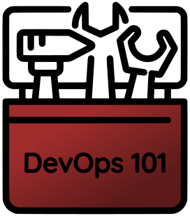
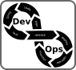
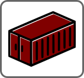

# DevOps-101

## Introduction

This repository is designed to help anyone with very little or no computing background learn the basics of DevOps. Course is self-paced and when you’re finished with it, you’ll know how to manage resouces in Azure Cloud, using Infrastructure as Code approach. 

Learning path is just a collection of publicly available courses, grouped by a specific topic. Some section have homework part - you can use it for a self-evalution. 

if you have any questions regarding this tutorial, please do not hesitate to contact me (using [Reddit](https://www.reddit.com/user/groovy-sky),[Linkedin](https://www.linkedin.com/in/jurijs-fadejevs/) or by pushing pull request to this repository).

## Prerequisites

Accounts:

* [MSDN accounts benefits](https://my.visualstudio.com/benefits)

* [Github account](https://github.com/signup)

* [Azure account](https://azure.microsoft.com/en-us/free/)

* [Docker Hub Account](https://hub.docker.com/signup)

Software:

* Some linux-based environment (like [Ubuntu](https://ubuntu.com/), [Fedora](https://getfedora.org/), [Suse](https://www.suse.com/) etc.)

* Some software for managing Azure (like [Azure CLI](https://docs.microsoft.com/en-us/cli/azure/install-azure-cli), [Azure Powershell](https://docs.microsoft.com/en-us/powershell/azure/get-started-azureps), [Azure Cloud Shell](https://docs.microsoft.com/en-us/azure/cloud-shell/overview) etc.)

* [Docker Engine](https://docs.docker.com/engine/install/)

* [Git](https://git-scm.com/downloads)

* [Ansible](https://docs.ansible.com/ansible/latest/installation_guide/intro_installation.html)

## Learning Path

### DevOps

 

https://devops.com/the-origins-of-devops-whats-in-a-name/

https://www.ibm.com/cloud/learn/devops-a-complete-guide

https://aws.amazon.com/devops/what-is-devops/#integration

### Linux

https://docs.microsoft.com/en-us/learn/modules/get-started-with-windows-subsystem-for-linux/

https://docs.microsoft.com/en-us/learn/modules/control-azure-services-with-cli/

https://linuxjourney.com/

#### Linux Homework

1. Deploy a Linux environmet (could be a Virtual Machine, Container Instance, Windows Subsystem for Linux etc.)
2. Install some webserver and reconfigure it so it would run on a custom port (like 8088)
3. Configure and apply a custom response page for the webserver (something like "Hello World!")

### Git

https://docs.microsoft.com/en-us/learn/paths/intro-to-vc-git/

https://learngitbranching.js.org/

https://docs.microsoft.com/en-us/learn/modules/introduction-to-github-visual-studio-code/

https://docs.microsoft.com/en-us/learn/modules/use-git-from-vs-code/

#### Git Homework

1. Fork this repository
2. Clone forked repository to your local environment (could be PC, Virtual Machine, WSL etc.)
3. Locally create a new branch and modify README.md file in it (by appending it with "Hello World!" line)
4. Commit and push all changes to remote Github repository (forked one, not original one)

### Python

 

https://docs.microsoft.com/en-us/learn/modules/python-introduction/

https://www.learnpython.org/en/Welcome

https://docs.microsoft.com/en-us/learn/modules/python-datatypes-numeric-operations/

https://www.coursera.org/learn/interactive-python-1

### Containerisation

https://www.ibm.com/cloud/learn/virtualization-a-complete-guide

https://www.ibm.com/cloud/learn/containers

https://www.ibm.com/cloud/learn/docker

https://docs.microsoft.com/en-us/learn/modules/intro-to-docker-containers/

https://www.youtube.com/watch?v=6gJs0F8V3tM

https://www.youtube.com/watch?v=Mvr9jTTnJrU

#### Containerisation Homework

1. Create Dockerfile (base image can be any prefferable Linux image) in which a webserver is installed and started 
2. Build an image from the Dockerfile (for that you'll need installed Docker Engine) and run the container (don't forget to expose port for HTTP)
3. Validate that you can access the webserver
4. Publish your image to your Docker Hub Registry (for that you'll need account in Docker Registry)

### Continuous Integration (CI)

https://aws.amazon.com/devops/continuous-integration/

https://lab.github.com/githubtraining/github-actions:-hello-world

#### Continuous Integration Homework

1. Create a new Github repository.
2. Create and configure Github Action, which builds Dockerfile and publishes it in Docker Hub Registry once every day.

### Azure

#### Intro

https://docs.microsoft.com/en-us/learn/modules/intro-to-azure-fundamentals/

https://docs.microsoft.com/en-us/learn/modules/create-an-azure-account/

https://docs.microsoft.com/en-us/learn/modules/tour-azure-portal/

#### Access and Security

https://docs.microsoft.com/en-us/learn/modules/explore-basic-services-identity-types/

https://devblogs.microsoft.com/devops/demystifying-service-principals-managed-identities/

https://docs.microsoft.com/en-us/cli/azure/create-an-azure-service-principal-azure-cli

https://docs.microsoft.com/en-us/learn/modules/manage-secrets-with-azure-key-vault/

https://docs.microsoft.com/en-us/learn/modules/secure-azure-resources-with-rbac/

##### Access and Security Homework

1. Register a new application in Azure Active Directory.
2. Generate and store a secret for the application.
3. Create a Key Vault and grant access to the application: on resouce level - Contributor role, on Vault level - policy which would allow to create and read secrets.
4. Using non-GUI approach (Powershell, Azure CLI etc.): authenticate to Azure using application's credentials; create a new secret, read it, delete the whole Key Vault. 

#### ARM Templates

https://docs.microsoft.com/en-us/learn/modules/create-azure-resource-manager-template-vs-code/

https://docs.microsoft.com/en-us/azure/azure-resource-manager/templates/key-vault-parameter?tabs=azure-cli

https://docs.microsoft.com/en-us/learn/modules/deploy-templates-command-line-github-actions/

##### ARM Templates Homework

1. Create a new Key Vault and add a secret with some value, which will be used as virtual machines password
2. Deploy [DNS Forwarder](https://azure.microsoft.com/en-us/resources/templates/dns-forwarder/) with your own parameters file, which for an user password would use Key Vault refference
3. Check the result by logging in VM using a password from the Key Vault

#### Networks

https://docs.microsoft.com/en-us/learn/modules/connect-on-premises-network-with-expressroute/

https://docs.microsoft.com/en-us/learn/modules/network-fundamentals/

https://docs.microsoft.com/en-us/learn/modules/connect-on-premises-network-with-vpn-gateway/

https://docs.microsoft.com/en-us/learn/modules/design-ip-addressing-for-azure/

https://docs.microsoft.com/en-us/learn/modules/integrate-vnets-with-vnet-peering/

https://docs.microsoft.com/en-us/learn/modules/hub-and-spoke-network-architecture/2-implement-hub-spoke

https://docs.microsoft.com/en-us/learn/modules/troubleshoot-azure-network-infrastructure/

https://docs.microsoft.com/en-us/learn/modules/configure-network-routing-endpoints/

https://docs.microsoft.com/en-us/learn/modules/design-implement-private-access-to-azure-services/

https://docs.microsoft.com/en-us/azure/load-balancer/components

##### Networks Homework

1. Create two VNets with different IP ranges (which doesn't overlap) and a storage account
2. Expose storage account's fileshare privately (using private endpoint) on both networks
3. Establish between networks VNet peering
4. Create two virtual machines - one in the first network with public IP and another in the second network without public IP
5. Connect remotely to publicly available machine and using it connect to the privately available VM
6. From both VMs resolve privately exposed fileshare (using nslookup or any other prefferable way) and validate that in both cases IP is private

#### Serverless

https://docs.microsoft.com/en-us/learn/modules/configure-azure-container-instances/

https://docs.microsoft.com/en-us/azure/azure-functions/create-first-function-cli-python?tabs=azure-cli%2Cbash%2Cbrowser

https://docs.microsoft.com/en-us/learn/modules/develop-test-deploy-azure-functions-with-core-tools/

https://docs.microsoft.com/en-us/learn/modules/monitor-github-events-with-a-function-triggered-by-a-webhook/

https://docs.microsoft.com/en-us/azure/azure-functions/functions-create-function-linux-custom-image?tabs=bash%2Cportal&pivots=programming-language-python

https://docs.microsoft.com/en-us/azure/azure-functions/functions-networking-options

https://docs.microsoft.com/en-us/azure/azure-functions/functions-compare-logic-apps-ms-flow-webjobs

##### Serverless Homework

1. Deploy [function for showing your public IP](https://www.serverlesslibrary.net/sample/b85aac2c-4ac5-4c00-9cf6-6c68841c00e5) and check how it works
2. Configure the same function but as a custom Docker container, deploy that image to Azure Container Instance with public IP address and exposed HTTP port and validate the result

### Azure DevOps

 

https://docs.microsoft.com/en-us/learn/modules/get-started-with-devops/

https://docs.microsoft.com/en-us/learn/modules/implement-ci-cd-azure-devops/

https://docs.microsoft.com/en-us/learn/modules/host-build-agent/

####  Azure DevOps Homework

1. Create [a new organization and project in Azure DevOps](https://docs.microsoft.com/en-us/azure/devops/organizations/accounts/create-organization?view=azure-devops).
2. Deploy and configure [self-hosted build agent on Azure Container Instance](https://github.com/groovy-sky/azure/blob/master/devops-docker-build-00/README.md#introduction).
3. Use self-hosted agent for [deploying a Python web app](https://docs.microsoft.com/en-us/azure/devops/pipelines/ecosystems/python-webapp?view=azure-devops).

### Ansible

https://docs.microsoft.com/en-us/azure/developer/ansible/

https://developers.redhat.com/courses/ansible/getting-started

https://docs.ansible.com/ansible/latest/user_guide/index.html#get

https://developers.redhat.com/courses/openshift-operators/ansible-review

https://developers.redhat.com/courses/ansible/web-server

https://docs.ansible.com/ansible/latest/scenario_guides/guide_azure.html

### Ansible Homework

1. Install [Ansible with Azure modules](https://docs.microsoft.com/en-us/azure/developer/ansible/install-on-linux-vm)
2. Choose some ARM template from [Azure Quickstart Templates](https://azure.microsoft.com/en-us/resources/templates/?sort=Popular) and deploy it using [azure_rm_deployment](https://docs.ansible.com/ansible/latest/collections/azure/azcollection/azure_rm_deployment_module.html#azure-rm-deployment-module)

### Infrastructure as Code

https://www.ibm.com/cloud/learn/infrastructure-as-code

https://docs.microsoft.com/en-us/devops/deliver/what-is-infrastructure-as-code

### Infrastructure as Code Homework

https://github.com/groovy-sky/iaac-demo

